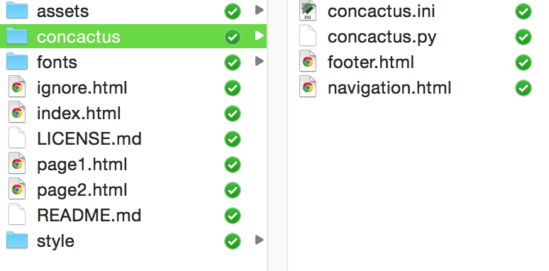
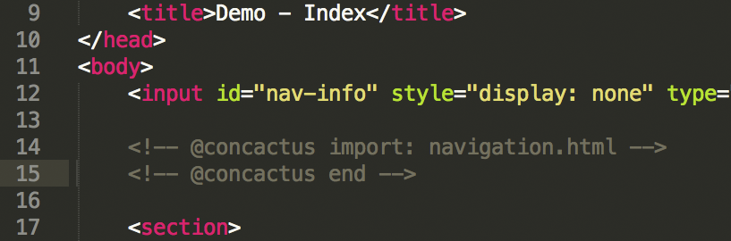
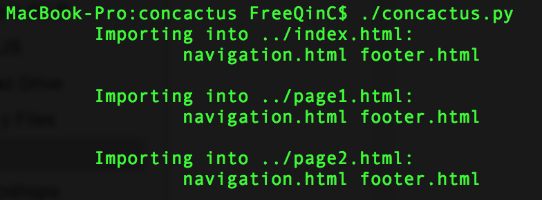
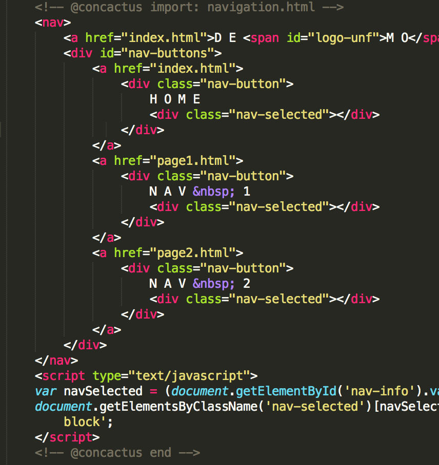
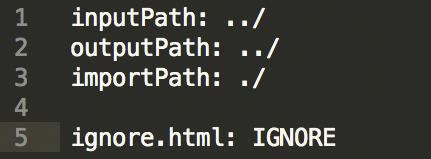
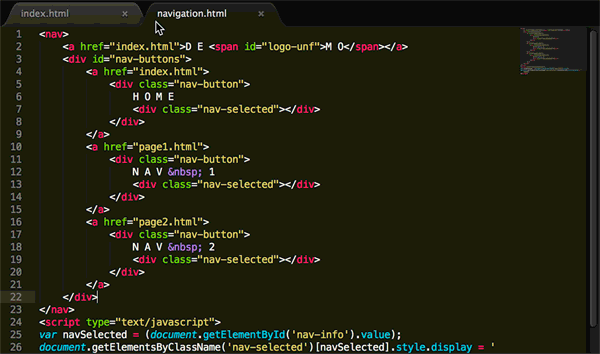

# Concactus
A python based preprocessor for HTML imports.  
Simple solution for importing common HTML on multiple pages!

### Why use this?

It's most lightweight option when it comes to final pages for the web. Concactus will actually write the imports to your HTML files. This makes the processed files testable locally and avoids having to deal with any server side requests that can potentially slow down your web pages with unnecessary fetch latency. 

## Demo

<a href="http://jesseqin.com/concactus/" target="_blank">Click here to view the demo.</a>

>This is the same demo that is available for download.

## Installation

Simply drag the 'concactus' folder into the same directory as your HTML files. 

> 

Place your importable HTML fragments in that concactus folder. In this example:

> footer.html and navigation.html

## Use

By default, concactus will target the HTML files that are in the same directory as the 'concactus' folder. In this example:

> ignore.html, index.html, page1.html, and page2.html

To indicate an HTML fragment import, simply use these comments in your HTML files:  
(using the navigation.html fragment here as an example)

> &lt;!-- @concactus import: navigation.html -->   
> &lt;!-- @concactus end -->  
> 

To execute the import, simply run the python script:

> ./concactus.py  
> 

The space between the @concactus comments will then be written over with the code from the HTML fragments:

> 

That's it!

## Optional Settings

You can access option settings by editing:

> concactus.ini  
>  

<em>All pathnames are relative to where conactus.ini is located.</em>  

<b>inputPath</b>: path to where input HTML files are located  
<b>outputPath</b>: path to where processed HTML files should be put
> By default, inputPath and outputPath are the same, meaning that concactus will simply overwrite the files in that path (best for organization). Don't worry, when run, concactus will only replace code inside the &lt;!-- @concactus --> comments.

<b>importPath</b>: path to where HTML fragments are located

### Ignoring Files
If you want concactus to ignore certain files within the inputPath while parsing, simply include that filename in the concactus.ini file like so:

> filetoignore.html: IGNORE

## Fin

Thank you for using concactus!  

>  